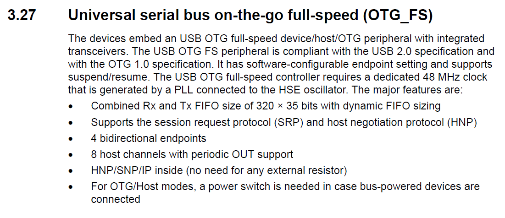

# black_pill_audio
usb audio device for the STM32F411CE black pill board

* for setup and config see https://github.com/STM32Libs/black_pill_cdc

# usb Audio
Middleware / USB_DEVICE / Class For FS IP / Audio Device Class

# USB User manual

* STM32Cube usb device library [user manual](https://www.st.com/resource/en/user_manual/dm00108129-stm32cube-usb-device-library-stmicroelectronics.pdf)

# USB Peripheral Datasheet
</img>

# USB Audio expansion

[STM32 USB Device Audio Streaming software expansion for STM32Cube](https://my.st.com/content/my_st_com/en/products/embedded-software/mcu-mpu-embedded-software/stm32-embedded-software/stm32cube-expansion-packages/x-cube-usb-audio.license=1603453757720.product=X-CUBE-USB-AUDIO.version=1.0.0.html#overview)

# Samples Comparision
* CubeMX : 6.0.1
* AWECore : ST_EVAL_CortexM4 Release-8.B.5.1_ST_Eval_build61
* STM32CubeExpansion_USBAudioStreaming : V1.0.0

## STM32F4xx_HAL_Driver
|CubeMX | Expansion USBAudioStreaming | AWE Sample |
|-------|---------------------------------------------|------------|
|2016 | 2017 update |  2016 base| 
| | no HS FS |  | 
| removed LS_PHY_6MHZ |  | DMA enable in USB_DevInit | 

## USB Lib Class Audio
|CubeMX | Expansion USBAudioStreaming | AWE Sample |
|-------|---------------------------------------------|------------|
|2015 update | 2015 |  |
| added AUDIO_HS/FS_BINTERVAL |  |  | 
| added AUDIO_IN/OUT_TC |  |  | 
| added PeriodicTC params |  | |
| return with types |  | |
|  | ST 2015 | ST version 2.4.2 dec 2015 |
|  | audio out | audio in/out HID in/out |
|  | mute only | volume |
|  |  | added cs43l22 and Disc platform |
|  | desc in usbd_audio.c | ext from USBDescriptors.c|
|  | USBD_AUDIO_Sync | no USBD_AUDIO_Sync own asrc|

# USB App
|CubeMX | Expansion USBAudioStreaming | AWE Sample |
|-------|---------------------------------------------|------------|
|usbd_audio_if v1.0_Cube 2020 | MCD App 2019  | 2016 |
|usbd_audio_if.h similar |   | similar |
|usbd_audio.c is in Class lib |   | V2.4.2 11 dec 2015 |
| 1 Audio Streaming interface| 2 Audio Streaming interfaces | 1 Audio streaming ?|
